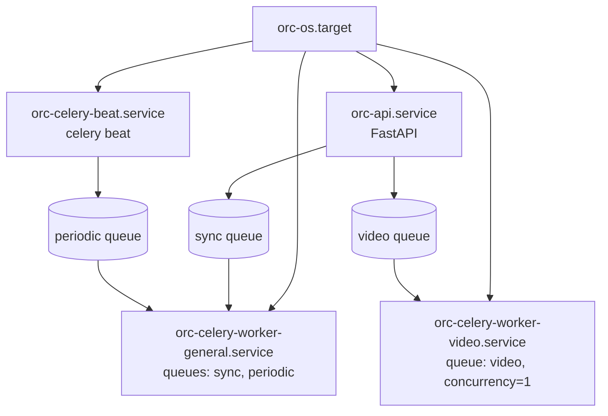

# OpenRiverCam OS
OpenRiverCam OS web dashboard for use on personal computer or Raspberry Pi device, operating in the field.

<figure>
    

</figure>
<br>

[](https://github.com/localdevices/ORC-OS/blob/main/LICENSE)
[](https://github.com/localdevices/nodeorc/blob/main/LICENSE)


* [What is OpenRiverCam OS](#what-is-openrivercam-os)
* [Installation](#installation)
  * [Installation on Raspberry Pi](#installation-on-raspberry-pi)
  * [Getting the image on the SD card](#getting-the-image-on-the-sd-card)
  * [Getting the image on the Compute Module](#getting-the-image-on-the-compute-module)
* [Installation via Docker on a server or your own computer](#installation-via-docker-on-a-server-or-your-own-computer)
* [Installation on your own device](#installation-on-your-own-device)
  * [Prerequisites](#prerequisites)
  * [Installation of components](#installation-of-components)
* [For developers](#for-developers)

> [!TIP]
> Rainbow Sensing is the company behind this entirely Open-Source software framework. We provide ready-to-use images
> with one year of support for a fixed fee. After the first year you may continue using the software on your own devices
> indefinitely. Contact info@rainbowsensing.com for more information. This image has:
>
> * 8 hours of support included over a year.
> * free remote access for your institute via a secured server. Access your device anywhere!
> * power management and on/off scheduling for sites with small power availability.
>
> We also provide training packages for field installation, field survey, image-based processing and principles,
> LiveOpenRiverCam server deployment and maintenance (central API for storage and further use of data).
> You may also contact us for training packages.

# What is OpenRiverCam OS?
OpenRiverCam OS is an entirely open-source dashboard to organize automated measurements of water levels and river flows
using camera videos. It is optimized for use on Raspberry Pi 5 devices and can utilize connected Raspberry Pi cameras.
What can you do with OpenRiverCam OS?
- Set up fully automated processing of videos into water levels and discharges, leveraging the power of
  [PyOpenRiverCam](https://github.com/localdevices/pyorc)
- Set up your own automated water level feeds from external (e.g. web-reporting) or connected devices
- Download your data, directly from the device via the web interface.
- Sync your data Live(!) to a [LiveORC](https://github.com/localdevices/LiveORC) server setup for operational real-time
  use of data in Decision Support Systems or forecast systems.
- Monitor currently ongoing tasks and logs.
- Investigate your time series and results with powerful figures and graphs
- Secure access to your device via a hashed password.
- Stay up-to-date with the latest developments of OpenRiverCam OS through Over-The-Air updates.

> [!NOTE]
> This README is only meant to instruct how to install OpenRiverCam OS on a device. For more information on how to
  build devices or how to use OpenRiverCam OS, please refer to the
  [documentation](https://localdevices.github.io/ORC-OS). If you are interested in our support or training modules,
  please visit https://openrivercam.com/contact.

Two approaches to installation are provided.

- Installation of ready-to-use images for Raspberry Pi 5 devices (can be acquired from Rainbow Sensing).
- Installation of back end and front end on your own selected device. We provide examples for Debian-based systems only.

## Installation on Raspberry Pi

If you have acquired a ready-to-use `.img` file from Rainbow Sensing for use on Raspberry Pi, please follow these
instructions.

### Prerequisites

- A Raspberry Pi 4 or 5 (recommended) device with 8GB of memory. We *DO NOT* support lower Raspberry Pi devices as
  these are not powerful enough and do not work with arm64 images. Please do not contact us for support on Raspberry Pi
  3 or lower devices.

- A suitable power supply. For Raspberry Pi 4, we recommend a 5V 2A power supply. For Raspberry Pi 5, we recommend a
  5V 5A power supply. For connections in the field to a 12V battery (e.g. combined with solar panels), you will require
  a buck step down converter (check your favorite electronics store or web store). Ensure that you find one with 12V
  input (up to 24V if your battery has a higher voltage) that delivers 5V at minimum 3A (2A for Raspberry Pi 4), and
  ideally 5V 5A for a more stable and reliable power.
   supply.

  See: https://www.raspberrypi.com/products/raspberry-pi-5/?variant=raspberry-pi-5-8gb
- An SD card (micro) of good quality (really...try to not underspend on cheap SD cards) of at least 32GB in size; OR
  (better) a Raspberry Pi 5 Compute Module with a carrier board, with at least 32GB eMMC flash storage. For SD-cards,
  ensure you have a microSD card reader slot on your device, or ensure you get a SD card adapter to fit it in a large
  SD card reader.

  See: https://www.raspberrypi.com/products/compute-module-5/?variant=cm5-104032
- A laptop or desktop computer with the "Raspberry Pi Imager" installed.

  See: https://www.raspberrypi.com/software/
- A UTP Cable and a free network port on your router or network switch (check the NOTE below if you only have WiFi).

If you want to collect videos with the same device, we also recommend to connect a Raspberry Pi (v3) camera to the device.
The OS will have Raspberry Pi camera libraries pre-installed. Alternatively you may use a suitable
IP Camera that can deliver video files via FTP or SFTP.

See: https://www.raspberrypi.com/products/camera-module-3/

For installation instructions of the Raspberry Pi Imager, please go to https://www.raspberrypi.com/software/

### Getting the image on the SD card
If you have a Raspberry Pi Compute Module, please go to the next section. If you have an SD card, continue here.

At this stage you will not need your Raspberry Pi yet. Just leave it in the box and start the laptop or desktop
computer that has Raspberry Pi Imager installed

> [!NOTE]
> The instructions below are written for Raspberry Pi imager >= 2.0. If you use an older version (1.x),
> the navigation is very similar, but slightly different.

* Put your SD card in a free SD-card reader slot on your laptop or desktop computer that has the Raspberry Pi imager
  installed.
* Download our image from the provided link to a location on your machine that you can find back easily, e.g.
  `C:\User\myuser\Downloads`. The file has the extension `img.gz`. *Do not* unpack this file. This is not necessary.
* Start the Raspberry Pi imager application.
* In the field "Device", select your Raspberry Pi device in the list.
  This can only be Raspberry Pi 4 or 5!
* In the field OS (Operating System), scroll all the way down and select "Use custom".
  Now navigate to the folder in which you stored the `img.gz` file and double-click it to select it. Click NEXT.
* In the field "Storage", click on "CHOOSE STORAGE". Select the SD card, typically called something like "Internal SD
  card reader".
* Click on "NEXT".
* You should now be on the Writing field. Click on WRITE.
* The application warns that you are about to ERASE all data. Click on I UNERSTAND, ERASE AND WRITE.
* When Raspberry OS Imager asks for your computer's root/super user password, please provide this.

> [!TIP]
> If you run Raspberry imager < 2.0, you can modify certain settings.
> If you do not have a UTP cable or free UTP slot conveniently nearby but instead
  want to rely on WiFi, then you should do this to enable WiFi! To do this Click on "EDIT SETTINGS" and follow the
  instructions below. **WARNING** do NOT change the user name!
> 1. Click on the "GENERAL" tab.
> 2. If you wish, activate "Set hostname" and set it to a clearly recognizable name only using small characters,
     numbers and normal hyphens `-`. This is particularly useful if you have a larger fleet of devices and wish them to
     have clearly recognizable names, e.g. defining the station number or station name or both. If you are installing
     stations throughout the city of Accra, you may for instance use the names `accra-0001` `accra-0002`, `accra-0003`
     and so on. You could also use your institute name like `rainbow-00001`, `rainbow-00002`, and so on. If you deselect
     the hostname will become `orcos`.
> 3. In case you are relying on WiFi to configure your device, activate "Configure wireless LAN". If not go to step
     7.
> 4. type in the exact capital sensitive (!) name of your WiFi SSID in the SSID field.
> 5. type the exact capital sensitive password in the password field.
> 6. Choose your 2-letter country code in the Wireless LAN country dropdown menu.
> 7. (!) Either disable "Set username and password" OR enable it and **set "Username" to `pi`** and choose a password.
     If you set the "Username" to something other than `pi`, this will render ORC-OS unusable so ALWAYS use `pi`
     as username!
> 8. Click on "SERVICES".
> 9. Make sure that "Enable SSH" is marked. You may login via SSH with your set password.
> 10. Click on "SAVE".
> 11. Click on "YES".

The SD card will now be prepared and verified. This will only take a few minutes. Time for a 🍵 or ☕.

Are you back after your 🍵 or ☕? You should now see a message "Write complete!". Click on FINISH.

If you do not see this, but instead get an error, then likely there is
something wrong with your SD card. Please check the following:

- Is the SD card read only? SD card casings (the larger ones) have a physical read only switch. If this is set to
  read only, please move the physical switch on the SD card to write.
- Is the SD card large enough?
- Is the SD card still ok? SD cards are known to deteriorate in time. This can result in SD cards still being readible
  but not anymore capable of writing. If the SD card is indicated to be read only, even with the physical switch in
  the right place, you probably have a broken SD card.

### Getting the image on the Compute Module
The process is almost the same as for the SD card. The only difference is that you need to ensure the Compute Module
device is connected to your computer in USB-mode, and select this device in the Raspberry Pi Imager.

Elaborate instructions how to get an image onto your compute module are provided on
https://www.raspberrypi.com/documentation/computers/compute-module.html#flash-compute-module-emmc

> [!NOTE]
> Sometimes carrier boards have difficulty getting mounted using the provided  instructions with the `rpiboot` tool.
> You may see that it is trying to mount but then it will fall back to standby in the midst.
  In this case try out the following steps:
  * Try to specify a mount folder by using `rpiboot -d mass-storage-gadget`.
  * Try resetting the mount directory using `./mass-storage-gadget/reset.sh`. After this retry mounting.
  * Reboot your computer, and retry the mount after the reboot is complete.

### Test your installation

1. In case you use an SD card, take it out of the reader and put it into your Raspberry Pi. With a Compute Module,
   switch back to normal operation mode. Usually this is done by removing power, removing a jumper and reapplying
   power.
2. Connect the Raspberry Pi's power adapter or other power source (e.g. 12V - 5V connection) and connect the UTP cable
   to your router or network switch. This should bring the device onto the same network as your computer.
3. Upon the first boot, a number of services and code compilations will take place in the background. The file system
   will be expanded to the full size and the device set to a low power usage during sleep time. This will take 2-3
   minutes. After this the device will automatically reboot itself. On a Raspberry Pi 5 you can notice this by the
   behaviour of the cooling fan. It will suddenly spin at full speed for a few seconds.
4. Open a browser and navigate to `http://orcos.local`. Replace `orcos` by your set hostname if you used OS
   customisation settings and applied a hostname. This should bring up the following page. If this page cannot
   be found, then try `http://orcos.home` or `http://orcos`

You now have to select your password. **Please ensure you remember this password**. If you forget it, you will not be
able to login anymore and since the service runs locally on the device, you will not be able to perform any recovery
without logging into the back-end.

> [!TIP]
> You should now reach the home page of the device. From here onwards, please follow our documentation pages
> (forthcoming).

# Installation via Docker on a server or your own computer

We have a fully working Docker composition that can be used to run OpenRiverCam OS on a server. This allows you to
run ORC-OS on your own computer via Docker, for instance to reprocess videos in a non-operational context. Basically
this gives you Desktop functionality without the need to install anything on your device.

Install as follows: first make sure `Docker` and `Docker Compose` are installed on your computer. On Windows you must
install Docker Desktop. On Linux you can use the linux package manager such as `apt`. On macOS you can use `homebrew`.

In windows make sure you use Windows System for Linux (WSL) or Git Bash as these have the same command interface as
linux.

1. Create a local data directory
    ```bash
    mkdir -p $HOME/.ORC-OS
    ```

2. Copy the `.env.example` file to `.env` and generate a secret key and set a data path. Replace `$HOME/.ORC-OS` with
   the desired folder (see step 1) and make sure it exists:
    ```bash
    cp .env.example .env
    # Generate a secure secret key and update it in .env
    sed -i "s/^ORC_SECRET_KEY=.*/ORC_SECRET_KEY=$(openssl rand -hex 32)/" .env
    sed -i "s|^ORC_DATA_PATH=.*|ORC_DATA_PATH=$HOME/.ORC-OS|" .env
    ```
3. Build and start all services:
   ```bash
   docker compose up --build -d
   ```
   You should now be able to reach the web interface at http://localhost:3000
  This also starts Redis, one Celery worker, and one Celery beat process for recurring background jobs.

4. View logs
    ```bash
    docker compose logs -f
    ```
5. Stop services
    ```bash
    docker compose down
    ```

# Installation on your own device
For installation on your own device, we provide examples for Debian-based systems only. As each device or OS may be
different in structure, naming of packages and exact approaches to establish services, we cannot provide a generic
installation guide. Also, you may have specific requirements, such as a specific version of Python or a specific
reverse proxy requirement. Hence the instructions below are provided as an example only. You need to understand the
following concepts to be able to install OpenRiverCam OS on your own device:
- Reverse proxy services (e.g. through `nginx` `apache` or other reverse proxy services)
- Python virtual environments (e.g. through `venv` or `conda`)
- Python Package management (e.g. through `pip`)
- Systemd services (and how to manage, start, stop and enable/disable them)

> [!CAUTION]
> Rainbow Sensing does not provide free support for installation on your own device. We cannot guarantee that the
> provided instructions will work for you. If you encounter any problems during installation, and you want us to assist
> or make a special recipe for your device please contact us for a support agreement at info@rainbowsensing.com

## Prerequisites
At minimum your device should have:
- A linux-based operating system (Debian adviced, but others may work as well)
- A network connection to the internet during installation
- Sufficient storage. We recommend at least 32GB of storage.
- Sufficient memory. We recommend at least 8GB of RAM.
- Adinistrator (sudo) rights on the device.
- Power supply, connectivity and wiring and boxing for deployment in the field (not in scope for these instructions)
- Python version 3.9, 3.10, 3.11 or 3.12 installed on your device. Earlier versions will NOT work. Later versions
  do not yet work. We recommend to use Python 3.12.

Of course, you will need a camera feed as well. Camera data should lead to files on your device with a recognizable
time stamp with date and time. For instance, `video_20250121T131523.mp4`. The exact format and naming convention can be
configured once ORC-OS is set up.

## Installation of components
The following components must be installed on your device.
1. A FastAPI back-end. This component is used by the front end to communicate with the device. It is a Python package
   that can be installed via pip.
2. A Redis service. This acts as Celery broker and result backend.
3. A Celery beat process. Celery schedules recurring tasks, such as maintenance and water-level jobs.
4. Celery worker processes. Although you can only define one worker for all of the jobs, we recommend two workers,
   split by queue type (see queue model below).
5. A web front-end and reverse proxy (`nginx` in this guide) to serve the dashboard and proxy `/api` requests.

We will go over each component in detail below. The commands are all based on Debian-based systems. If you use a
different system, you will need to adapt the commands accordingly.

### Installation of dependencies
First update your repositories and install the necessary linux libraries.

```bash
# update all installed packages
sudo apt update
sudo apt upgrade
# update the required dependencies
sudo apt install -y ffmpeg git libsm6 libxext6 libgl1 nginx python3-dev python3-venv libgdal-dev vim jq redis-server
# ensure redis starts automatically
sudo systemctl enable --now redis.service
```

### FastAPI back-end
FastAPI is a python-based API library. We highly recommend setting up a virtual Python environment for the FastAPI backend. This ensures that the each component. This will ensure that you do not mix up
dependencies between components. We here assume you will run things from a user's home directory. The following commands
will:
- create a virtual environment in the user's home directory
- activate the virtual environment
- install the latest version of the ORC-API
- make a fresh database
- deactivate the virtual environment

```bash
# set up the virtual environment
python3 -m venv $HOME/venv/orc-api
# activate the virtual environment
source $HOME/venv/orc-api/bin/activate
# get latest version name
ORC_VERSION=$(curl -s https://api.github.com/repos/localdevices/ORC-OS/releases/latest | jq -r .tag_name)
echo "Installing ORC-API $VERSION"
# install the latest ORC-OS API
pip install git+https://github.com/localdevices/ORC-OS.git@$ORC_VERSION
# ensure a fresh database it created
orc db migrate
# deactivate the virtual environment
deactivate
```
To test if the installation was successful, you can run the following command:
```bash
# activate the virtual environment
source $HOME/venv/orc-api/bin/activate
# start the API interactively, wait up to a few minutes for the first start
uvicorn orc_api.main:app --host 0.0.0.0 --port 5000 --workers 1
```
This should start the API interactively on port 5000. Note that a number of functions must
be compiled and loaded into memory. This may take a few seconds to a few minutes to complete.
This is only required once. The second time the API is started, it will start much faster.
If this runs without errors, press Ctrl+C to stop the API.

It is wise to now check if all required files seem present.

By default, ORC OS stores all its data on the user's home folder under `$HOME/.ORC-OS`.
The database should already be there in a file `$HOME/.ORC-OS/orc-os.db` You can check if this
file is present:

```bash
ls ~/.ORC-OS -l
```
This should return the file and file details. If you have already started the API interactively, you will also
see a folder for `incoming` and `uploads`. In `incoming` you should eveentually place videos that you wish to
automatically process. In `uploads` you will find the processed videos, once you start running videos. A user
will usually never look at these files and folders directly. They are only used internally by the API.

### Run ORC-OS back-end services with systemd
Naturally you do not want to manually start FastAPI, Celery workers and Celery beat every time the device boots.
To automatically orchestrate starting of all services in your
native installation, we recommend one `target` unit (`orc-os.target`) that groups dependent services:

- `orc-api.service` for FastAPI.
- `orc-celery-beat.service` for periodic schedule publishing.
- `orc-celery-worker-general.service` for `sync` and `periodic` queues.
- `orc-celery-worker-video.service` for `video` queue only, with `concurrency=1`.

The queue split is important for stability:

- `periodic`: recurring maintenance tasks started by beat (e.g. disk maintenance, water level retrieval). These do not
  require large amounts of resources and memory, and therefore may be expected to always run side-by-side with any
  video processing.
- `sync`: video synchronization tasks (`sync_video`, `sync_videos_batch`). These may take time, but not significant
  resources and therefore also can run side-by-side with video processing.
- `video`: heavy video processing tasks (`run_video`). Entirely separated from the other queues.

We strongly recommend running `video` on a dedicated worker with `--concurrency=1`. This prevents multiple concurrent
video processes from running at once and consuming too much memory. A second worker can safely process `sync` and
`periodic` jobs in parallel as these do not require significant resources.



> [!TIP]
> We **strongly encourage to set a `ORC_SECRET_KEY` environment variable** in the FastAPI unit file. This ensures that
> the API is protected against unauthorized access. You can generate a random key with the following command:
>
> ```bash
> SECRET_KEY=$(head -c 16 /dev/urandom | base64)
> echo $SECRET_KEY
> ```

Below are example unit files. You need to adapt the paths to your system. Particularly, note that your python
version may be different. We support up to python 3.14.

Also replace:
- `YOUR_USERNAME` by the user running this service (does not need to be root).
- `YOUR_SECRET_KEY_GOES_HERE` by the actual secret key you generated for the device.

Place these files in `/etc/systemd/system/`.

`orc-os.target`
```ini
[Unit]
Description=ORC-OS Application Stack
Requires=redis.service
After=network.target redis.service

[Install]
WantedBy=multi-user.target
```

`orc-api.service`
```ini
[Unit]
Description=ORC-OS API
Before=nginx.service
After=network.target redis.service
PartOf=orc-os.target
Wants=orc-celery-beat.service orc-celery-worker-general.service orc-celery-worker-video.service
Upholds=orc-celery-beat.service orc-celery-worker-general.service orc-celery-worker-video.service

[Service]
User=YOUR_USERNAME
WorkingDirectory=/home/YOUR_USERNAME
Environment="PATH=/home/YOUR_USERNAME/venv/orc-os/bin:/usr/bin"
Environment="ORC_INCOMING_DIRECTORY=/home/YOUR_USERNAME/.ORC-OS/incoming"
Environment="ORC_HOME=/home/YOUR_USERNAME/.ORC-OS"
Environment="ORC_SECRET_KEY=YOUR_SECRET_KEY_GOES_HERE"
ExecStart=/home/YOUR_USERNAME/venv/orc-os/bin/uvicorn orc_api.main:app --host 0.0.0.0 --port 5000 --workers 1
Restart=always
RestartSec=10
TimeoutStopSec=10

[Install]
WantedBy=orc-os.target

```

`orc-celery-beat.service`
```ini
[Unit]
Description=ORC-OS Celery Beat Scheduler
After=redis.service orc-api.service
PartOf=orc-os.target orc-api.service
BindsTo=orc-api.service

[Service]
type=simple
User=YOUR_USERNAME
WorkingDirectory=/home/YOUR_USERNAME
Environment="PATH=/home/YOUR_USERNAME/venv/orc-os/bin:/usr/bin"
Environment="ORC_INCOMING_DIRECTORY=/home/YOUR_USERNAME/.ORC-OS/incoming"
Environment="ORC_HOME=/home/YOUR_USERNAME/.ORC-OS"
Environment="ORC_SECRET_KEY=YOUR_SECRET_KEY_GOES_HERE"
ExecStart=/home/YOUR_USERNAME/venv/orc-os/bin/celery -A orc_api.celery_app:celery_app beat --loglevel=info
Restart=always
RestartSec=10
TimeoutStopSec=10

[Install]
WantedBy=orc-os.target
```

`orc-celery-worker-general.service`
```ini
[Unit]
type=simple
Description=ORC-OS Celery Worker for sync and periodic schedulers
After=redis.service orc-api.service
PartOf=orc-os.target orc-api.service
BindsTo=orc-api.service

[Service]
User=YOUR_USERNAME
WorkingDirectory=/home/YOUR_USERNAME
Environment="PATH=/home/YOUR_USERNAME/venv/orc-os/bin:/usr/bin"
Environment="ORC_INCOMING_DIRECTORY=/home/YOUR_USERNAME/.ORC-OS/incoming"
Environment="ORC_HOME=/home/YOUR_USERNAME/.ORC-OS"
ExecStart=/home/YOUR_USERNAME/venv/orc-os/bin/celery -A orc_api.celery_app:celery_app worker -Q sync,periodic --loglevel=info
Restart=always
RestartSec=10
TimeoutStopSec=10

[Install]
WantedBy=orc-os.target
```

`orc-celery-worker-video.service`
```ini
[Unit]
Description=ORC-OS Celery Worker for video processing
After=redis.service orc-api.service
PartOf=orc-os.target orc-api.service
BindsTo=orc-api.service

[Service]
type=simple
User=YOUR_USERNAME
WorkingDirectory=/home/YOUR_USERNAME
Environment="PATH=/home/YOUR_USERNAME/venv/orc-os/bin:/usr/bin"
Environment="ORC_INCOMING_DIRECTORY=/home/YOUR_USERNAME/.ORC-OS/incoming"
Environment="ORC_HOME=/home/YOUR_USERNAME/.ORC-OS"
ExecStart=/home/YOUR_USERNAME/venv/orc-os/bin/celery -A orc_api.celery_app:celery_app worker -Q video --pool=solo --concurrency=1 --loglevel=info
Restart=always
RestartSec=10
TimeoutStopSec=10
KillMode=control-group

[Install]
WantedBy=orc-os.target

```

After creating these files, reload systemd and start the full stack.
```bash
# refresh systemd services
sudo systemctl daemon-reload
# enable for starting automatically on boot
sudo systemctl enable orc-os.target
# start the full stack (api + beat + both workers)
sudo systemctl start orc-os.target
```
To inspect logs from all back-end services:
```bash
sudo journalctl -u orc-api.service -u orc-celery-beat.service -u orc-celery-worker-general.service -u orc-celery-worker-video.service
```
or for live updating messages:
```bash
sudo journalctl -u orc-api.service -u orc-celery-beat.service -u orc-celery-worker-general.service -u orc-celery-worker-video.service -f
```

### Web front-end
To ensure that the web front end is served out and can be updated by the Over-The-Air update
process, you must ensure that the web files are unpacked in `$HOME/.ORC-OS/www` and that a symbolic link to the
typical location of web-files is made. Also, your `$USER` must be able to write to this folder and have www access
rights to serve out the files on a web server. The updated front end files will then be written to `$HOME/.ORC-OS/www`.
This is done as follows:

```bash
# make sure the www folder exists
sudo mkdir /var/www/orc-os
# change group ownership to www-data
sudo chown -R $USER:www-data /var/www/orc-os
# set permissions to 775
sudo chmod -R 775 /var/www/orc-os
# change group permissions with inheritance
sudo chmod g+s /var/www/orc-os
# add $USER to www-data group
sudo usermod -aG www-data $USER
# make symbolic link to accessible place for OTA updates
sudo ln -sf /var/www/orc-os $HOME/.ORC-OS/www
sudo chown -R $USER:$USER $HOME/.ORC-OS/www
```
You can now upload the last version of the web front end to the web server. First download it from the releases page
https://github.com/localdevices/ORC-OS/releases

Go to the last release and download the asset `frontend-build.zip`. Unzip this file in the folder `$HOME/.ORC-OS/www`.

### Reverse proxy setup
Finally, the web front end should be served. We use `nginx` here but any other reverse proxy will work as well.

Make a configuration in `/etc/nginx/sites-available/orc-os` as follows
```
server {
        listen 80 default_server;
        listen [::]:80 default_server;
        client_max_body_size 100m;

        root /var/www/orc-os;

        index index.html;

        server_name orc-os;
        disable_symlinks off;
        location / {
                # First attempt to serve request as file, then
                # as directory, then index.html, then fall back to displaying a 404.
                try_files $uri $uri/ /index.html =404;
        }
        location /api/ {
                # Proxy pass to the FastAPI server
                proxy_pass http://127.0.0.1:5000;

                # Proxy settings for correct header handling
                proxy_set_header Host $host;
                proxy_set_header X-Real-IP $remote_addr;
                proxy_set_header X-Forwarded-For $proxy_add_x_forwarded_for;
                proxy_set_header X-Forwarded-Proto $scheme;
                proxy_set_header Upgrade $http_upgrade;
                proxy_set_header Connection "Upgrade";
                proxy_cache_bypass $http_upgrade;

                proxy_connect_timeout       10s;
                proxy_send_timeout          30s;
                proxy_read_timeout          30s;
                send_timeout                30s;

                proxy_next_upstream error timeout invalid_header http_500 http_502 http_503 http_504;
                proxy_next_upstream_tries 3;

        }


}
```
The `root` directive must point to the folder where the web front end is stored.
To enable the nginx configuration, first remove any symlink enabled site, such as the default site
`/etc/nginx/sites-enabled/default`, then create the symlink for the orc-os front end, finally restart nginx. You can
do this as follows

```bash
# get rid of any existing default site
sudo rm /etc/nginx/sites-enabled/default
# create a symlink to your brand new orc-os front end
sudo ln -s /etc/nginx/sites-available/orc-os /etc/nginx/sites-enabled/orc-os
# restart nginx to refresh
sudo systemctl restart nginx
```

Open your favorite browser and navigate to the hostname of the device on which you have installed. E.g. `http://orc-os`
or `http://orc-os.local`. If you installed on your own computer, then this should be `http://localhost`.
You will arrive at the landing page from where you can set a password and start using the device.

# For developers

Clone the repository with ssh and move into the cloned folder.

```
git clone git@github.com:localdevices/ORC-OS.git
cd ORC-OS
```

Setup a virtual developers environment and install the package with symbolic links as follows:
```
python -m venv $HOME/venv/orc-os
source $HOME/venv/orc-os/bin/activate
pip install -e .

```

Make sure you install pre-commit hooks so that FastAPI python code is properly linted before pushing.
```
pip install pre-commit
pre-commit install
```
